# Loyalty API To Entity Read/Write Matrix

```mermaid
flowchart TD
    staffOtpSend["POST /auth/staff/otp/send"]
    staffOtpVerify["POST /auth/staff/otp/verify"]
    customerOtpSend["POST /loyalty/otp/send"]
    customerOtpVerify["POST /loyalty/otp/verify"]
    closeTable["POST /billing/close-table"]
    cronEarn["POST /cron/loyalty/process-earn"]
    walletGet["GET /loyalty/wallet"]

    staffUser["STAFF_USER"]
    staffOtp["STAFF_OTP"]
    customerUser["CUSTOMER_USER"]
    wallet["POINTS_WALLET"]
    bill["BILL"]
    billLineItem["BILL_LINE_ITEM"]
    ledger["POINTS_LEDGER"]
    outbox["NOTIFICATION_OUTBOX"]
    tableSession["TABLE_SESSION"]

    staffOtpSend -->|"write otp row"| staffOtp
    staffOtpVerify -->|"read otp row"| staffOtp
    staffOtpVerify -->|"read staff by phone"| staffUser
    staffOtpVerify -->|"delete otp row"| staffOtp

    customerOtpSend -->|"write otp row"| staffOtp
    customerOtpVerify -->|"read otp row"| staffOtp
    customerOtpVerify -->|"upsert customer"| customerUser
    customerOtpVerify -->|"ensure wallet row"| wallet
    customerOtpVerify -->|"delete otp row"| staffOtp

    closeTable -->|"read open session"| tableSession
    closeTable -->|"create closed bill"| bill
    closeTable -->|"create bill lines"| billLineItem
    closeTable -->|"debit points"| wallet
    closeTable -->|"append redeem txn"| ledger
    closeTable -->|"enqueue redeem msg"| outbox
    closeTable -->|"set session closed"| tableSession

    cronEarn -->|"scan earn pending bills"| bill
    cronEarn -->|"credit points"| wallet
    cronEarn -->|"append earn txn"| ledger
    cronEarn -->|"update earn status done"| bill
    cronEarn -->|"enqueue earn msg"| outbox

    walletGet -->|"read wallet balance"| wallet
```

## Endpoint-by-endpoint entity interaction

| Endpoint | Reads | Writes |
|---|---|---|
| `POST /auth/staff/otp/send` | `STAFF_USER` (optional pre-check by phone) | `STAFF_OTP` (upsert OTP hash, cooldown, ttl) |
| `POST /auth/staff/otp/verify` | `STAFF_OTP`, `STAFF_USER` | `STAFF_OTP` (attempts++/delete), JWT issuance (stateless) |
| `POST /loyalty/otp/send` | `CUSTOMER_USER` (optional pre-check by phone) | `STAFF_OTP` (reuse OTP table) |
| `POST /loyalty/otp/verify` | `STAFF_OTP`, `CUSTOMER_USER`, `POINTS_WALLET` | `CUSTOMER_USER` (create/update), `POINTS_WALLET` (initialize), `STAFF_OTP` delete |
| `POST /billing/close-table` | `TABLE_SESSION`, `POINTS_WALLET` (for redeem validation) | `BILL`, `BILL_LINE_ITEM`, `POINTS_WALLET` debit, `POINTS_LEDGER` redeem event, `NOTIFICATION_OUTBOX` redeem message, `TABLE_SESSION` close |
| `POST /cron/loyalty/process-earn` | `BILL` (`earn_status=pending`), `POINTS_WALLET` | `POINTS_WALLET` credit, `POINTS_LEDGER` earn event, `BILL` (`earn_status=done`, `earn_points`), `NOTIFICATION_OUTBOX` earn message |
| `GET /loyalty/wallet?user_id=` | `POINTS_WALLET` | None |

## Primary query/update patterns

- `STAFF_USER`: query by `phone`; rarely update profile/role.
- `STAFF_OTP`: query by `phone`; upsert on send; delete on success; increment attempts on failure.
- `CUSTOMER_USER`: query by `phone`; create-or-get on verify.
- `POINTS_WALLET`: query by `user_id`; atomic `ADD/SUB` on redeem/earn.
- `BILL`: query by `bill_id`, `external_bill_ref`, and `earn_status` for cron; write-once at close plus earn status updates.
- `BILL_LINE_ITEM`: query by `bill_id`; write once at close.
- `POINTS_LEDGER`: query by `user_id` or `idempotency_key`; append-only writes.
- `NOTIFICATION_OUTBOX`: query pending by schedule; write event rows at redeem/earn; update status/retries by sender worker.
- `TABLE_SESSION`: query active by venue/table; update status transitions.
