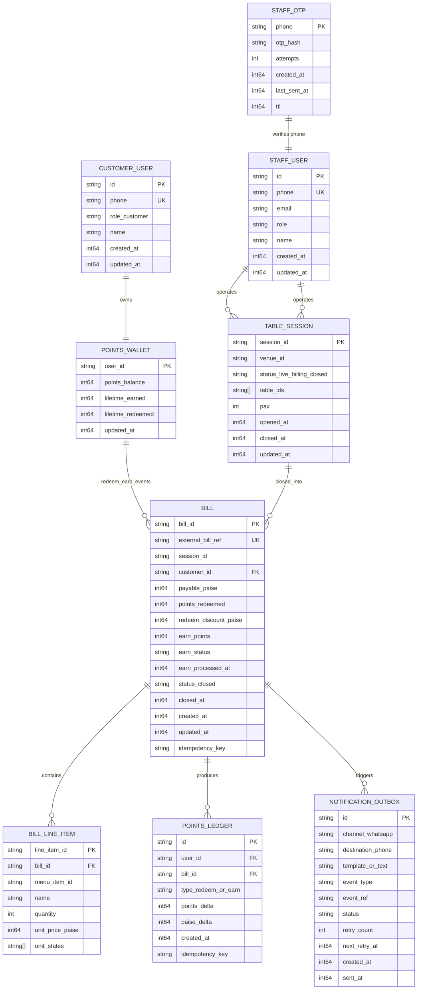

# Loyalty Entities And Query Patterns

## Query + update patterns per entity

Staff login uses WhatsApp OTP + stateless JWT (exp next 2 AM IST). There is no `STAFF_SESSION` row in DynamoDB and no password fields on staff users.

- `STAFF_USER`
  - Query: by `phone` for OTP login, by `id` from JWT claims.
  - Update: admin create/update staff profile and role; no password fields (OTP-only auth).

- `STAFF_OTP`
  - Query: by `phone` during OTP verify.
  - Update: upsert on send (hash + cooldown timestamp), increment attempts on failed verify, delete on success/expiry.

- `CUSTOMER_USER`
  - Query: by `phone` during customer OTP verify.
  - Update: create-or-get on first verify, name refresh if provided.

- `POINTS_WALLET`
  - Query: by `user_id` for balance display/redeem validation.
  - Update: atomic debit on close-table redeem; atomic credit in cron earn processor.

- `TABLE_SESSION`
  - Query: by active status (`live`/`billing`) for order board, by `session_id` for close flow.
  - Update: transition `live -> billing -> closed`; set close timestamps and bill linkage.

- `BILL`
  - Query: by `bill_id`, by `external_bill_ref`, by `earn_status=pending` for cron.
  - Update: create at authoritative close-table commit; set redeem fields at close; later set earn fields/status in cron.

- `BILL_LINE_ITEM`
  - Query: by `bill_id` to render/print historical bill and compute earn base.
  - Update: immutable after close-table commit (append-only write at bill creation).

- `POINTS_LEDGER`
  - Query: by `user_id` for audit/history; by `idempotency_key` for replay protection.
  - Update: insert one row per redeem and one per earn (append-only).

- `NOTIFICATION_OUTBOX`
  - Query: by `status=pending` and `next_retry_at<=now` for sender worker.
  - Update: insert on redeem/earn event; mark `sent` on success; increment retry/backoff on failure.
